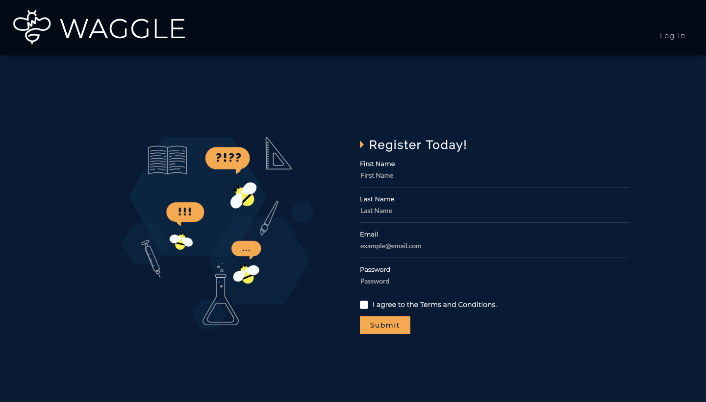
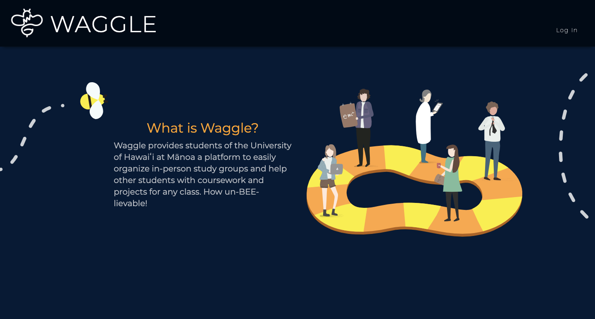

  
  

## Vision

Waggle’s stated purpose is to facilitate the formation of study groups, but the ultimate goal of our web app is to foster a sense of community built around a common love of learning, cooperation, and also a little friendly competition. We wanted to encourage students to work in groups because we believed, and still do believe, that one of the best ways to learn difficult concepts is by putting abstract ideas into words and hearing from multiple perspectives. To that end, our goal was not only to facilitate the formation of study groups but make it fun as well through sleek design and engaging game mechanics. In order to inspire a sense of community and cooperation, we decided to theme our project around honey bees. If you’re confused about the name, Waggle, it’s a reference to the waggle dance that honey bees use to teach each other where to find food.

## Description

The first page that the user sees is the landing page, which looks incredible thanks to my very talented teammates. After they log in, they are greeted with the user homepage, which displays both completed and upcoming study sessions. A first time user probably hasn’t joined any sessions, so it will look pretty empty to start. To actually join a study session the user must go their profile page to update their personal courses. If the user has already taken a course, they should add themselves to the course as a royal bee. Otherwise, they should add themselves as a worker bee. After that, the user may go to the search page to discover new study sessions that they can join. On the search page, the user may use various filters and sort options to control which sessions are displayed and how. After they haved joined a session, it will appear on the calendar page as well as the user homepage. On the calendar page, the user can view all of the study sessions that they have joined. Clicking on a particular date will bring up additional information on the study sessions that they scheduled for that day. Once a session is over, the user can view their completed sessions on the user home page. Here, they will be prompted to distribute honey to the other attenbees depending on how helpful they were during the session. After the honey is done processing, i.e. 24 hours have passed or everyone has responded, the user may collect the honey that they were rewarded from the session. Unfortunately, if the user did not respond, they do not get any honey. Heading over to the leaderboard page, users can view their standing relative to their peers. Right now the honey is being added to the user’s exp, but that may change at a later date.

## Lessons in Responsibility

My responsibilities to the group included the calendar page, the search page, and the honey system. In terms of just writing code, the most difficult thing to wrap my head around, at first, was the difference between state and props in React. However, the most difficult aspect of the project as a whole was scheduling dependent issues between multiple people and staying committed to our own self made due dates. One strategy that I found effective in keeping pace was to make verbal commitments to have something done by a given time. By keeping the group up to date on my own progress, this allowed my teammates to make more informed decisions about their own schedule and even make suggestions about what to work on next. Psychologically, it’s also much harder to break a promise to the group, which was a useful motivator when I might otherwise be tempted to procrastinate. Scheduling issues aside, working in a group was a lot more fun than expected, and it was a delight to see everyone’s work come together so nicely.

